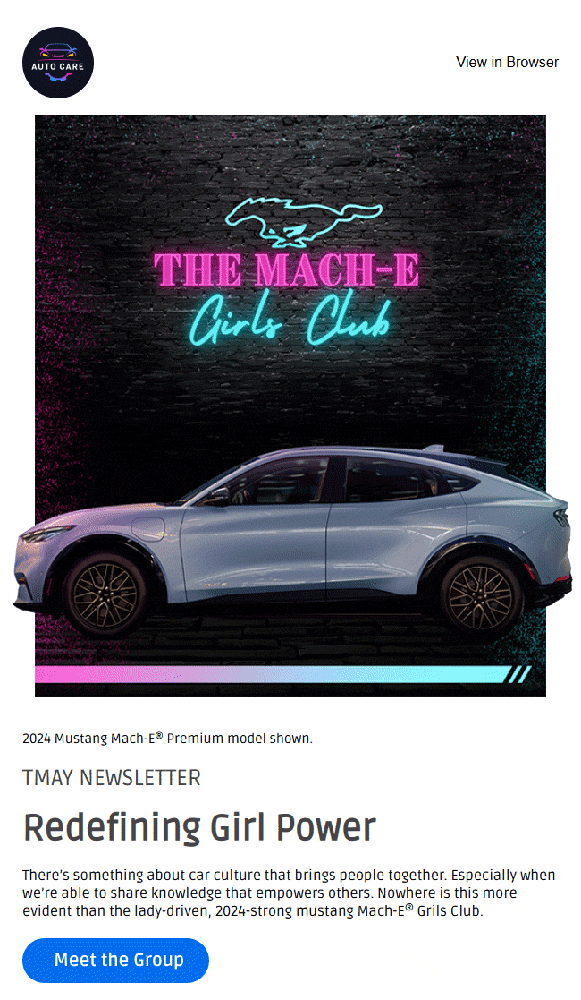
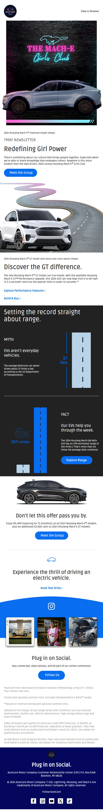
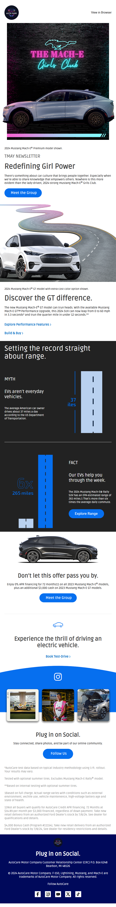
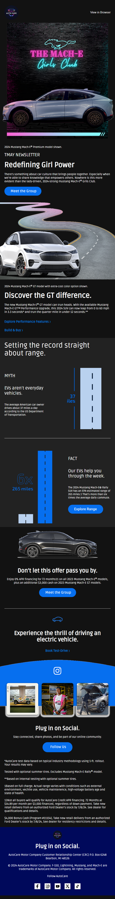
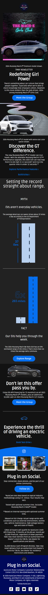

# Auto Care

Welcome to the **Auto Care** project repository! This project is designed to showcase and manage an auto care service. Below are the files and resources, including previews.

---

## **Features**
- Clean and professional design for both desktop and mobile views.
- Light and dark themes for better user experience.
- Optimized assets for enhanced performance.

---


### **GIFs**

**Auto Care Thumbnail Preview**  


**Auto Care GIF**  


---

## **Preview Images**

### Desktop Previews

**Light Theme**  



**Dark Theme**  


### Mobile Previews

**Dark Theme**  


**Light Theme**  


---


## **Setup Instructions**

1. Clone the repository:
   ```bash
   git clone https://github.com/ShahebAli247bd/auto-care.git


MIT License

Copyright (c) 2024 ShahebAli247bd

Permission is hereby granted, free of charge, to any person obtaining a copy
of this software and associated documentation files (the "Software"), to deal
in the Software without restriction, including without limitation the rights
to use, copy, modify, merge, publish, distribute, sublicense, and/or sell
copies of the Software, and to permit persons to whom the Software is
furnished to do so, subject to the following conditions:

The above copyright notice and this permission notice shall be included in all
copies or substantial portions of the Software.

THE SOFTWARE IS PROVIDED "AS IS", WITHOUT WARRANTY OF ANY KIND, EXPRESS OR
IMPLIED, INCLUDING BUT NOT LIMITED TO THE WARRANTIES OF MERCHANTABILITY,
FITNESS FOR A PARTICULAR PURPOSE AND NONINFRINGEMENT. IN NO EVENT SHALL THE
AUTHORS OR COPYRIGHT HOLDERS BE LIABLE FOR ANY CLAIM, DAMAGES OR OTHER
LIABILITY, WHETHER IN AN ACTION OF CONTRACT, TORT OR OTHERWISE, ARISING FROM,
OUT OF OR IN CONNECTION WITH THE SOFTWARE OR THE USE OR OTHER DEALINGS IN THE
SOFTWARE.
